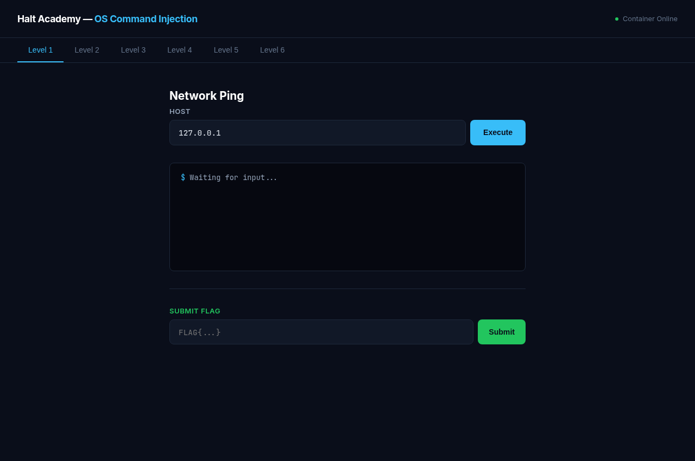
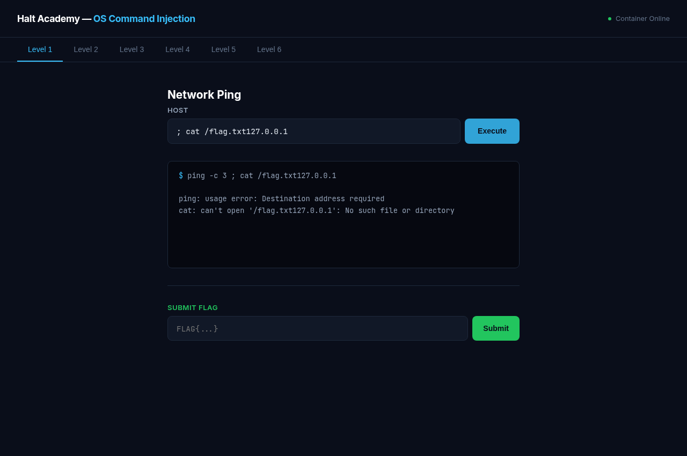
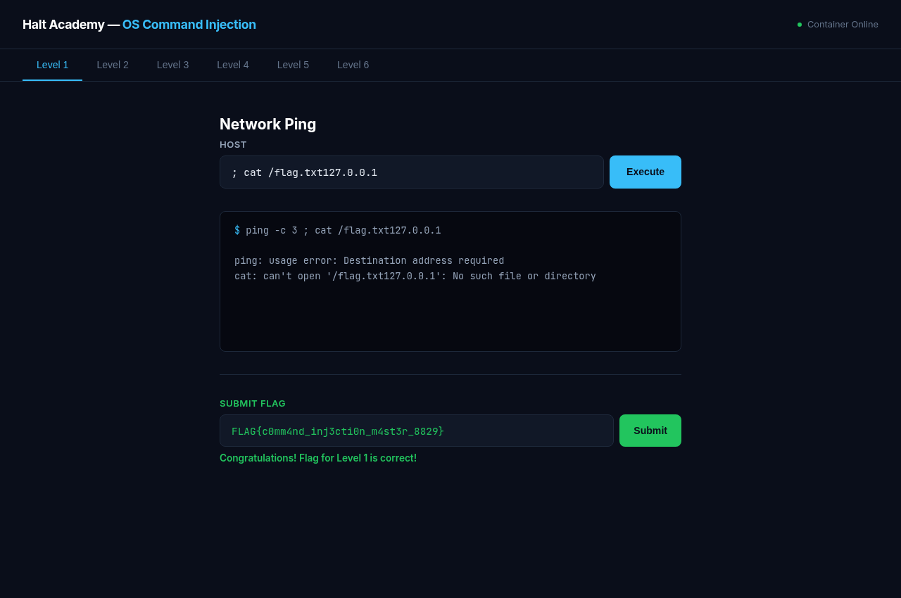
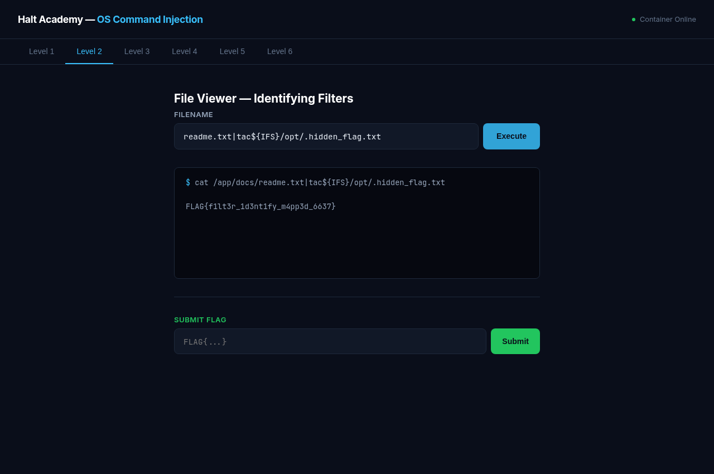
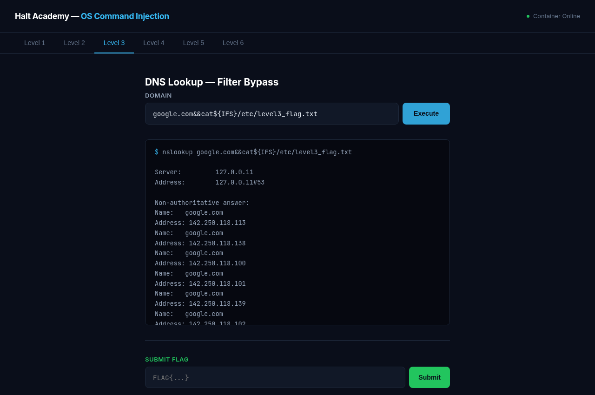
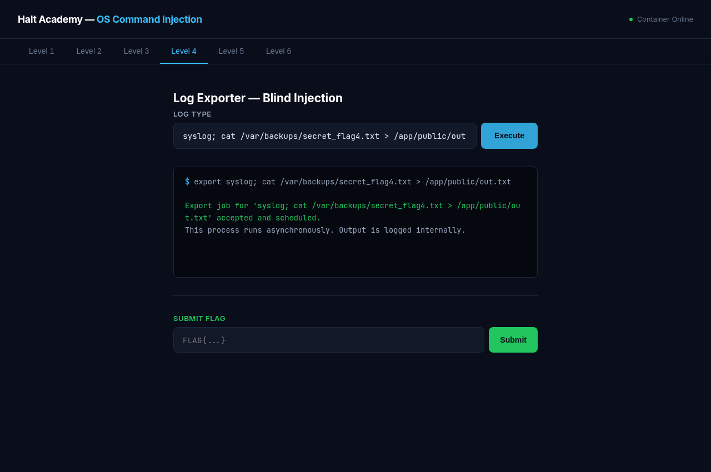
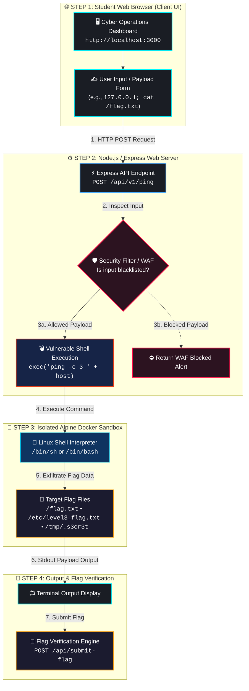

<div align="center">

# 🛡️ OS Command Injection Docker Lab

### *Interactive Cybersecurity Training Environment & WAF Evasion CTF*

[](https://www.docker.com/)
[](https://nodejs.org/)
[](https://expressjs.com/)
[](#-lab-challenges--vulnerability-breakdown)
[](#-license--disclaimer)

---



</div>

---

## 📌 Table of Contents

- [Overview](#-overview)
- [Lab Interface & Screenshots](#-lab-interface--screenshots)
- [Key Features](#-key-features)
- [Lab Architecture & Threat Model](#-lab-architecture--threat-model)
- [Quick Start & Installation](#-quick-start--installation)
  - [Prerequisites](#prerequisites)
  - [Method 1: Automated Script Setup (Recommended)](#method-1-automated-script-setup-recommended)
  - [Method 2: Docker Compose Direct Launch](#method-2-docker-compose-direct-launch)
  - [Method 3: Local Host (Node.js Direct Execution)](#method-3-local-host-nodejs-direct-execution)
- [Lab Challenges & Vulnerability Matrix](#-lab-challenges--vulnerability-matrix)
  - [Level 1: Network Ping Utility (In-Band Injection)](#level-1-network-ping-utility-in-band-injection)
  - [Level 2: File Viewer (Identifying Silent WAF Filters)](#level-2-file-viewer-identifying-silent-waf-filters)
  - [Level 3: DNS Resolver Utility (Filter & Space Bypass)](#level-3-dns-resolver-utility-filter--space-bypass)
  - [Level 4: Log Exporter (Blind Command Injection)](#level-4-log-exporter-blind-command-injection)
  - [Level 5: User Lookup (Character & Slash Evasion)](#level-5-user-lookup-character--slash-evasion)
  - [Level 6: Process Monitor (Command Blacklist Evasion)](#level-6-process-monitor-command-blacklist-evasion)
- [Flag Verification System](#-flag-verification-system)
- [Repository Structure](#-repository-structure)
- [Defensive Security & Remediation Guide](#-defensive-security--remediation-guide)
- [License & Disclaimer](#-license--disclaimer)

---

## 🎯 Overview

The **OS Command Injection Docker Lab** by **Halt Academy** is an interactive, multi-level cybersecurity learning platform designed to teach practical security assessment, Web Application Firewall (WAF) bypass techniques, and secure application architecture.

Operating system command injection (OS Command Injection) occurs when an application passes unsanitized user-supplied data into a system shell prompt. This lab provides a safe, fully containerized target environment simulating real-world security vulnerabilities—ranging from basic in-band command execution to complex filter evasion and blind out-of-band exfiltration.

---

## 📸 Lab Interface & Screenshots

| **Dashboard Overview & Dark UI** | **Level 1: In-Band Command Execution** |
| :---: | :---: |
|  |  |

| **CTF Flag Submission & Real-time Validation** | **Level 2: Silent WAF Evasion** |
| :---: | :---: |
|  |  |

| **Level 3: Filter Bypass (`${IFS}` & `&&`)** | **Level 4: Blind Command Injection** |
| :---: | :---: |
|  |  |

---

## ⚡ Key Features

- 🎯 **6 Progressive Hands-on Levels**: Structured from beginner-friendly string concatenation to advanced bypasses of blacklisted commands, operators, spaces, and path slashes.
- 🖥️ **Cyber Operations Center UI**: Glassmorphic, dark-mode terminal user interface equipped with live feedback boxes, input parameter forms, and instant CTF flag submission triggers.
- 🐳 **Isolated Docker Sandbox**: Single-command container deployment built on Alpine Linux with pre-placed flags, diagnostic utilities (`ping`, `nslookup`, `ps`, `bash`), and automated container health checks.
- 🚩 **Automated Flag Verification Engine**: Standardized CTF flag format (`FLAG{...}`) verified through secure REST API endpoints.
- 🛡️ **Comprehensive Remediation Docs**: Full secure coding guide demonstrating safe process execution with `execFile`/`spawn` and input validation allowlists.

---

## 🏗️ Lab Architecture & Threat Model



### 🔄 Request & Execution Pipeline

| Step | Component | Action / Process | Security Layer / Threat |
| :---: | :--- | :--- | :--- |
| **1️⃣** | **Web UI** | Student inputs parameter / command injection payload | Untrusted Client Input |
| **2️⃣** | **Express API** | Express route receives payload via `req.body` | HTTP Parameter Parser |
| **3️⃣** | **WAF Filter** | Checks input against blacklists (spaces, `;`, `cat`, etc.) | Input Filter / Evasion Check |
| **4️⃣** | **Process Execution** | Passes payload directly to system shell interpreter | **Vulnerable Endpoint (`exec()`)** |
| **5️⃣** | **Docker Sandbox** | Shell executes payload & reads target CTF flags | Isolated Container Filesystem |
| **6️⃣** | **CTF Verification** | Student submits extracted flag `FLAG{...}` for validation | Real-time Flag Verification |


---

## 🚀 Quick Start & Installation

### Prerequisites

Ensure the following tools are installed on your host system:
- **[Docker](https://docs.docker.com/get-docker/)** (v20.10+)
- **[Docker Compose](https://docs.docker.com/compose/install/)** (v2.0+)
- *(Optional)* **Node.js** (v18+) for local host execution without containers.

---

### Method 1: Automated Script Setup (Recommended)

1. Clone the repository:
   ```bash
   git clone git@github.com:haltacademy/Command-Injection-Docker-Lab.git
   cd Command-Injection-Docker-Lab
   ```

2. Make the startup script executable and launch the environment:
   ```bash
   chmod +x start-lab.sh
   ./start-lab.sh
   ```

3. Open your web browser and navigate to:
   👉 **`http://localhost:3000`**

---

### Method 2: Docker Compose Direct Launch

Build and start the container in detached mode:
```bash
docker-compose up --build -d
```

Verify container status:
```bash
docker-compose ps
```

To stop and remove containers:
```bash
docker-compose down
```

---

### Method 3: Local Host (Node.js Direct Execution)

If you prefer to run the Node.js application without Docker:

```bash
# 1. Install dependencies
npm install

# 2. Start the application
npm start
```

> ⚠️ **Security Warning**: Local execution without Docker runs injected commands directly on your host machine. Running inside Docker is strongly recommended for security isolation.

---

## 🧩 Lab Challenges & Vulnerability Matrix

| Level | Name | Vulnerable Endpoint | Filter / WAF Rules | Flag Target File | Example Payload Concept |
| :---: | :--- | :--- | :--- | :--- | :--- |
| **1** | **Network Ping** | `POST /api/v1/ping` | None (Direct Concatenation) | `/flag.txt` | `127.0.0.1; cat /flag.txt` |
| **2** | **File Viewer** | `POST /api/v2/fileview` | Blocks `;`, `&&`, `||`, `cat`, `more`, spaces | `/opt/.hidden_flag.txt` | `readme.txt\|tac${IFS}/opt/.hidden_flag.txt` |
| **3** | **DNS Resolver** | `POST /api/v3/lookup` | Blocks `;` and space characters | `/etc/level3_flag.txt` | `google.com&&cat${IFS}/etc/level3_flag.txt` |
| **4** | **Log Exporter** | `POST /api/v4/system-export` | Blind / Async (No stdout in HTTP response) | `/var/backups/secret_flag4.txt` | `syslog; cat /var/backups/secret_flag4.txt > /app/public/out.txt` |
| **5** | **User Lookup** | `POST /api/v5/usercheck` | Blocks `;`, `\|`, `&`, ` `, `/`, `` ` ``, and read commands | `/tmp/.s3cr3t` | `root${IFS}&&${IFS}sort${IFS}${HOME:0:1}tmp${HOME:0:1}.s3cr3t` |
| **6** | **Process Monitor**| `POST /api/v6/procmon` | Blocks exact command names (`cat`, `ls`, `grep`, etc.) | `/var/spool/.loot.txt` | `node\|c'a't${IFS}/var/spool/.loot.txt` |

---

### Level Details & Vulnerability Analysis

#### Level 1: Network Ping Utility (In-Band Command Injection)
- **Concept**: User input is concatenated directly into system command `ping -c 3 ${host}` via `child_process.exec()`.
- **Target Flag**: `/flag.txt`
- **Sample Payload**: `127.0.0.1; cat /flag.txt`

#### Level 2: File Viewer (Identifying Silent WAF Filters)
- **Concept**: A custom security filter inspects input for specific operators (`;`, `&&`, `||`, `cat`, `more`, spaces) and returns a generic error.
- **Target Flag**: `/opt/.hidden_flag.txt`
- **Sample Payload**: `readme.txt|tac${IFS}/opt/.hidden_flag.txt`

#### Level 3: DNS Resolver Utility (Filter & Space Bypass)
- **Concept**: Naive blacklist filter blocks semicolon `;` and space characters. Standard chaining operators like `&&` or `||` along with internal field separator `${IFS}` remain active.
- **Target Flag**: `/etc/level3_flag.txt`
- **Sample Payload**: `google.com&&cat${IFS}/etc/level3_flag.txt`

#### Level 4: System Log Exporter (Blind Command Injection)
- **Concept**: Asynchronous background command execution where process stdout is not returned in the HTTP response.
- **Target Flag**: `/var/backups/secret_flag4.txt`
- **Sample Payload**: `syslog; cat /var/backups/secret_flag4.txt > /app/public/out.txt` (Access via `http://localhost:3000/out.txt`).

#### Level 5: User Lookup (Character & Slash Evasion)
- **Concept**: WAF blocks common characters (`;`, `|`, `&`, ` `, `/`) and commands (`cat`, `head`, `tail`). Requires using environment variable slicing (`${HOME:0:1}` for `/`) and alternative utilities (`sort`, `nl`, `strings`).
- **Target Flag**: `/tmp/.s3cr3t`

#### Level 6: Process Monitor (Command Blacklist Evasion)
- **Concept**: WAF blocks explicit command names (`cat`, `grep`, `whoami`, `ls`) but permits quoting and escape operators.
- **Target Flag**: `/var/spool/.loot.txt`
- **Sample Payload**: `node|c'a't${IFS}/var/spool/.loot.txt`

---

## 🚩 Flag Verification System

Found a flag? Submit it directly through the dashboard UI or programmatically via HTTP REST request:

### HTTP Request
```bash
curl -X POST http://localhost:3000/api/submit-flag \
     -H "Content-Type: application/json" \
     -d '{"level": 1, "flag": "FLAG{c0mm4nd_inj3cti0n_m4st3r_8829}"}'
```

### JSON Response
```json
{
  "success": true,
  "message": "Congratulations! Flag for Level 1 is correct!",
  "level": 1
}
```

---

## 📁 Repository Structure

```text
Command-Injection-Docker-Lab/
├── Dockerfile                  # Alpine Linux container setup with flags & utilities
├── docker-compose.yml          # Container orchestration & port mappings
├── start-lab.sh                # Automated execution script with dependency checks
├── server.js                   # Express application & vulnerable challenge endpoints
├── package.json                # Project manifest & Node.js dependencies
├── .gitignore                  # Git exclusions for dependencies and temp files
├── public/                     # Static assets
│   ├── css/
│   │   └── style.css           # Custom dark glassmorphism cyber UI styles
│   └── js/
│       └── app.js              # Frontend tab switching & flag submission logic
├── views/
│   └── index.ejs               # Main EJS laboratory dashboard
└── screenshots/                # Documentation screenshot assets
    ├── dashboard_overview.png
    ├── level1_inband_injection.png
    ├── level1_flag_submission.png
    ├── level2_waf_bypass.png
    ├── level3_filter_bypass.png
    ├── level4_blind_injection.png
    ├── level5_user_check.png
    └── level6_process_monitor.png
```

---

## 🛡️ Defensive Security & Remediation Guide

### ❌ Vulnerable Implementation (Unsanitized Concatenation)

Passing untrusted user input directly into system shell functions like `exec()` exposes applications to command injection:

```javascript
// VULNERABLE: Input concatenated directly into shell interpreter
const { exec } = require('child_process');

app.post('/api/v1/ping', (req, res) => {
  const host = req.body.host;
  const command = `ping -c 3 ${host}`; // Dangerous string interpolation

  exec(command, (err, stdout, stderr) => {
    res.json({ output: stdout || stderr });
  });
});
```

---

### ✅ Secure Implementation (Parameterized Process Execution)

To prevent command injection, avoid invoking system shells. Use `execFile()` or `spawn()` with arguments passed as separate array elements:

```javascript
// SECURE: Argument array prevents shell operator evaluation
const { execFile } = require('child_process');
const net = require('net');

app.post('/api/v1/ping', (req, res) => {
  const { host } = req.body;

  // 1. Strict Input Validation (Allowlisting)
  if (!host || (!net.isIP(host) && !/^[a-zA-Z0-9.-]+$/.test(host))) {
    return res.status(400).json({ error: 'Invalid hostname or IP address format.' });
  }

  // 2. Parameterized Execution (No shell interpreter invoked)
  execFile('/bin/ping', ['-c', '3', host], { timeout: 5000 }, (err, stdout, stderr) => {
    if (err) {
      return res.status(500).json({ error: 'Command execution failed.' });
    }
    res.json({ output: stdout });
  });
});
```

### 🔒 Container & Infrastructure Defense Best Practices
1. **Least Privilege Execution**: Never run web applications as `root` inside Docker containers. Use non-root container users (`USER node`).
2. **Read-Only File System**: Mount web directories as read-only (`read_only: true` in Docker Compose) to block web shell drops.
3. **Minimize Container Utilities**: Exclude non-essential tools (`cat`, `bash`, `curl`, `netcat`) from production container images.

---

## 📄 License & Disclaimer

This project is licensed under the **MIT License**.

### ⚠️ Educational Use Disclaimer
This laboratory environment is created strictly for **educational, defensive cybersecurity training, and authorized research purposes**. Attempting command injection techniques on systems without prior explicit authorization from the system owner is strictly illegal.

Created with ❤️ by **[Halt Academy](https://github.com/haltacademy)**.
